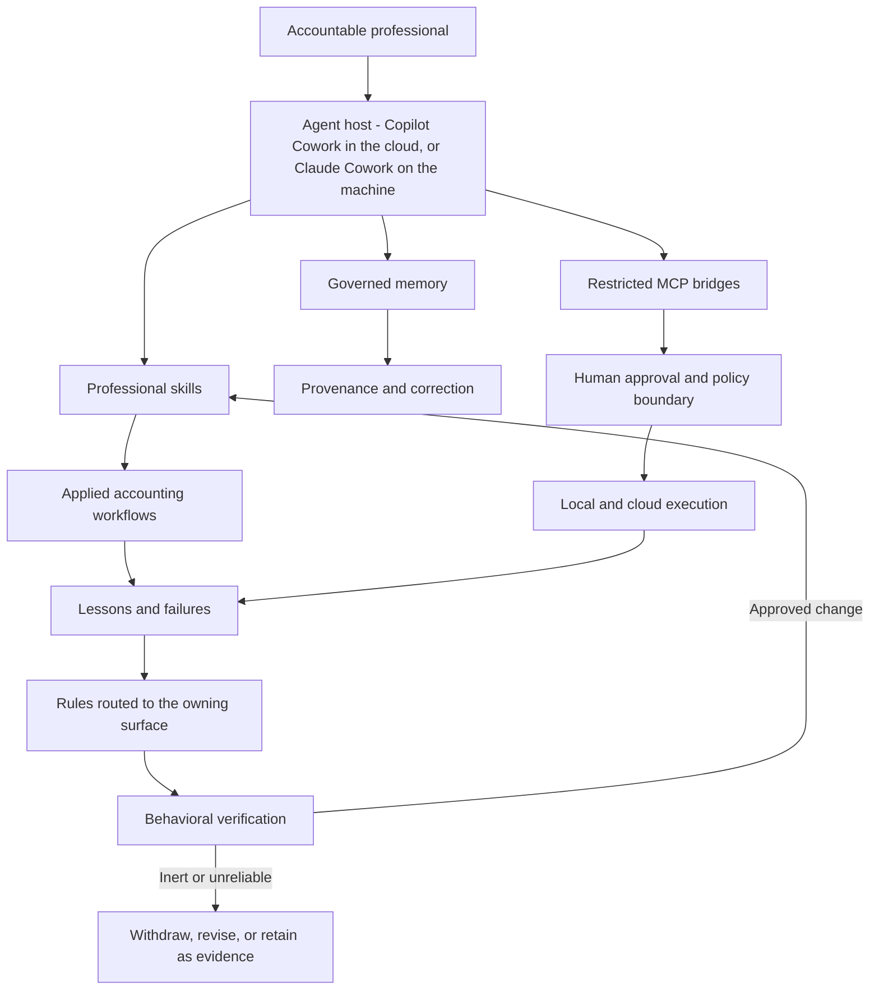

# Agent of Record

[](https://github.com/jordanmrash/agent-of-record/actions/workflows/ci.yml) [](https://github.com/jordanmrash/agent-of-record/releases/latest) [](LICENSE)

**A governed foundation for AI agents doing work a person signs their name to, built and operated in public accounting: durable memory, human-approved execution, behavioral learning, and auditable automation.**

## See it run first

```bash
python examples/synthetic-control-loop/run.py
```

About a second on a clean checkout; no tenant, tunnel, browser or network, and nothing in the repository is modified. A fictional month-end workflow receives a source bundle with a required segment missing. A deterministic gate refuses it, and the repository's own verification harness then judges the delivered rule against a control:

<!-- DEMO:start -->
```text
$ python examples/synthetic-control-loop/validate_manifest.py examples/synthetic-control-loop/inputs/incomplete
workpaper : Fictional month-end reconciliation
  present  A  segment-a.csv    3 rows  Opening balances
  present  B  segment-b.csv    3 rows  Period activity
  present  C  segment-c.csv    2 rows  Adjustments
  MISSING  D  segment-d.csv            Closing balances from the subledger
HARD STOP: required segment(s) D absent. No workpaper was produced.
[exit 3]

$ python examples/synthetic-control-loop/run.py --check
Synthetic control loop - workpaper-required-segment-missing
  ok    gate accepts the complete input set (exit 0)
  ok    gate refuses the set missing Segment D, names it, produces nothing (exit 3)
  ok    harness judges the recorded arms EFFECTIVE (3 carried pass, control fails)
CONTROL_LOOP: OK - a missing input became a hard stop, and the delivered rule is measured, not assumed.
[exit 0]
```
<!-- DEMO:end -->

The scenario, the recorded transcripts and what each exit code means are in the [synthetic control-loop example](examples/synthetic-control-loop/README.md).

**Contents:** [Set up on your machine](#set-up-on-your-machine) · [Why this exists](#why-this-exists) · [What this demonstrates](#what-this-demonstrates) · [Architecture](#architecture) · [Measured at this release](#measured-at-this-release) · [The bridges](#the-bridges) · [How experience becomes a tested control](#how-experience-becomes-a-tested-control) · [Start here](#start-here) · [Repository map](#repository-map) · [Validation](#validation) · [Author perspective](#author-perspective) · [Status and roadmap](#status-and-roadmap) · [Boundaries](#boundaries) · [License](#license)

| | |
|---|---|
| **Status** | v0.3.4 - portable. Windows and macOS, with a contributor on the macOS side. `main` keeps its history; changes arrive by pull request and the gate runs on both platforms in CI. Interfaces may still change between minor versions. |
| **Platform** | Windows and macOS/Linux. The local layer is VS Code tasks over per-platform launchers - PowerShell and batch files on Windows, shell scripts under `Startup/posix/` elsewhere. The command bridge is one implementation with one refusal set, proven on whichever platform runs the gate. |
| **Host** | The four bridges are standard MCP servers. Microsoft 365 Copilot Cowork is the client this repository was built and operated against; it is reached through a dev tunnel only because that client is cloud-hosted. Claude Cowork, in a local desktop session, starts the one server it needs - the approved command executor - as a stdio process with no tunnel. That route ran on a Mac on 2026-09-15 ([evidence](docs/evidence/mac-operated-2026-09-15.md)): the executor and the install check are operated, and the skills-plugin upload is not yet confirmed. |
| **Install** | [Choose your route](docs/install/README.md), then your platform: [Copilot Cowork on Windows](docs/setup.md) or the [Claude Cowork pages](docs/install/claude-cowork.md) - a bare machine to reachable bridges and an installed configuration, with `scripts/install_check.py` proving it by completing a real MCP handshake against each bridge. On the hosted route `scripts/copilot/personalize.py` replaces every placeholder in one pass and each bridge ships its connector package under `Startup/Plugins/`. The ten skills ship as one plugin, two ways: this repository is a plugin marketplace (`/plugin marketplace add jordanmrash/agent-of-record`, then `/plugin install agent-of-record-skills@agent-of-record`), and each release carries the built `agent-of-record-skills-<platform>.plugin` for **Customize → Plugins → Add → Upload plugin**. Neither install has been operated on a real machine yet. |

Professional work is adopting AI faster than it is developing the controls, operating models, and institutional knowledge needed to use it reliably.

This repository is a working reference implementation of that missing foundation. It demonstrates how AI agents can preserve governed knowledge, act through defined approval boundaries, capture operational failures, convert lessons into durable controls, and test whether those controls actually change behavior.

The foundation comes first. Applied tax, accounting, workpaper, research, review, and communication skills will be added as independently tested components built on top of it.

> This is not a collection of prompts and it is not presented as an official Microsoft product. It is a practitioner-built laboratory for the controlled use of agentic AI in public accounting and other professional environments where a person remains accountable for the result.

## Set up on your machine

Pick the product you use, then your platform. Each page is complete on its own — you
should not need to read anything else to get running. The two hosts start from different
places, so each route installs a different subset of this repository;
[Choose your route](docs/install/README.md) compares them feature by feature.

### Copilot Cowork — runs in Microsoft's cloud and reaches the bridges through a dev tunnel

- [What this repository adds to Copilot Cowork](docs/install/copilot-cowork.md)
- [Windows PC](docs/setup.md) · operated daily
- Mac or Linux · not supported - Copilot Cowork is Windows only ([why the hosted macOS page was retired](docs/setup-macos.md))

### Claude Cowork — runs on your machine in a local session and starts the executor itself; no tunnel

- [What this repository adds to Claude Cowork](docs/install/claude-cowork.md)
- [Windows PC](docs/install/claude-cowork-windows.md) · not yet operated
- [Mac](docs/install/claude-cowork-mac.md) · executor operated 2026-09-15 ([evidence](docs/evidence/mac-operated-2026-09-15.md)); skills-plugin upload not yet confirmed

**Not yet operated** means nobody has run that page end to end. A cell changes on evidence,
not on prose: open a pull request with your `install_check.py` result and it moves.

Agents: the install contract is in [`AGENTS.md`](AGENTS.md); it applies to every cell.

## Why this exists

The profession does not primarily have a prompting problem. It has an operating-model problem:

- What may an agent remember, and how is an incorrect memory corrected?
- What may it execute, and where must a person approve the action?
- How does a failure become a durable control instead of an anecdote in a chat transcript?
- How do we know a new rule changed behavior rather than merely adding more prose?
- How are production systems, confidential information, and publication boundaries protected?
- What evidence exists when a reviewer asks what happened, who changed it, and why?

This repository makes those questions concrete.

## What this demonstrates

- **Governed memory** with provenance, correction, version history, and one authoritative home per fact.
- **Restricted execution** through a batch bridge that accepts a filename, not a free-form command.
- **Human approval at the action boundary**, rather than a general statement that a human remains “in the loop.”
- **Explicit production controls** based on configuration flags and allowlists, not guessed from names.
- **Operational learning** that records the failed approach, the working approach, and the evidence.
- **Routed controls** that deliver a lesson into the skill or tool that owns the failure.
- **Behavioral verification** using three carried tests and a control arm.
- **Declared blind spots** where an automated check cannot observe direct session behavior.
- **A disclosure scan in CI** that refuses real user paths on either platform, tunnel hostnames, tenant identifiers and credential shapes on every push and pull request, and clean-room tooling that can rebuild a public tree from a private working copy when needed.
- **Negative results preserved as evidence**, including rules that were measured ineffective or inert.

## Architecture



See [the detailed architecture](docs/architecture.md), [the public-accounting vision](docs/public-accounting-vision.md), and [the control map](docs/public-accounting-control-map.md).

## Measured at this release

These are measurements from the published tree, not aspirational claims. The table is generated by `scripts/measured_table.py` from the digest marker, the corpus, the routes, the ledger, the tier file and the gate itself; `--check` runs inside the release gate and fails when the table is stale.

<!-- MEASURED:start -->
| Measure | Result |
|---|---:|
| Recorded lesson entries | 120 |
| Entries with an authored rule | 94 |
| Rules in the always-on tier | 31 |
| Lesson keys routed into skills | 86 |
| Lesson keys routed into plugin tools | 5 |
| Routed skills | 8 |
| Self-test suites run by the gate | 17 |
| Checks in the release gate | 30 |
| Behaviorally verified effective rules | 1 |
| Behaviorally verified inert rules | 0 |
| Rules a checker enforces on some surfaces and is blind on others | 6 |
| Rules proven fully enforced across every behavior surface | 0 |

<sub>Generated by `scripts/measured_table.py`; the release gate fails when this table is stale.</sub>
<!-- MEASURED:end -->

The last result matters. Every automated check is currently blind to at least direct session behavior. The repository reports that boundary rather than calling partial enforcement complete.

See [Measured Results and Honest Boundaries](docs/measured-results.md).

## The bridges

Copilot Cowork, on Windows, reaches four bridges through a dev tunnel. Claude Cowork registers one of them - the approved command executor - as a local stdio server, because it reads connected folders and drives a browser first-party and has no path to Power Automate administration. Which bridge exists for which product and platform is declared once, in [`docs/bridge-facts.json`](docs/bridge-facts.json), and every surface that restates it is checked against that file. Either way the bridges provide narrow, governed access to the machine and Power Platform:

| Port | Bridge | Purpose | Implementation (products · platforms) |
|---|---|---|---|
| 8931 | Playwright | Browser automation in a signed-in profile | Upstream `@playwright/mcp`, stateful - Copilot Cowork · Windows |
| 8932 | Filesystem | Read and write explicitly named local roots | Upstream filesystem MCP server, stateless - Copilot Cowork · Windows |
| 8933 | Approved batch executor | Execute an existing `.bat` or `.cmd` (`.sh` on macOS) under `CommandJobs` | Own code, stateless - Copilot Cowork · Windows; Claude Cowork · Windows and macOS |
| 8934 | Power Automate | Flow definitions, runs, connections, solutions, DLP, and ownership | Own code, 29 tools, stateless - Copilot Cowork · Windows |

The 8933 executor accepts no command string, arguments, interpreter, working directory, environment, timeout override, or elevation option. The agent proposes an exact batch file, a person approves it, the filesystem bridge writes it, and the executor runs that named file.

The 8934 bridge uses delegated authorization-code and PKCE authentication. Environments are denied until allowlisted, production is flagged explicitly, writes can be pinned off per environment, deletion requires the current flow name, and mutating attempts are audited.

## How experience becomes a tested control

```text
Failure or better method
        ↓
Lessons corpus: failed / worked / why / evidence / Pattern-Key
        ↓
Generated delivery
  ├── always-on instruction digest
  ├── owning SKILL.md
  ├── owning plugin tool description
  └── per-surface preflight gate
        ↓
Behavioral verification
  ├── three tests with the rule carried
  └── one control without it
        ↓
Effective / inert / unreliable / ineffective / invalid
```

Delivery is not treated as enforcement. A rule in a skill reaches only sessions that load that skill. A linter that reads batch files cannot observe a direct action taken in the chat. The system records those distinctions.

## Start here

1. Run the demonstration: `python examples/synthetic-control-loop/run.py`. It shows a missing input becoming a hard stop, then a delivered rule judged against a control - see the [synthetic control-loop scenario](examples/synthetic-control-loop/README.md).
2. To run the bridges yourself, pick your product and platform under [Set up on your machine](#set-up-on-your-machine); [CoworkConfig/README.md](CoworkConfig/README.md) explains how to start with an empty corpus rather than the author's.
3. Read [Public Accounting Vision](docs/public-accounting-vision.md).
4. Review [Public Accounting Control Map](docs/public-accounting-control-map.md).
5. Read [Architecture and Trust Boundaries](docs/architecture.md).
6. Run the repository validation described in [Quick Start](docs/quickstart.md).
7. Review [Limitations](docs/limitations.md) before adapting any bridge.

## Repository map

```text
.github/         contribution, CI and Dependabot configuration
CommandJobs/     approval-gated standing jobs; archive/ holds spent one-offs and the macOS evidence scripts
CoworkConfig/    skills, memory, instructions, lesson routing, verification; plugin/ is the generated plugin root a marketplace installs
docs/            public-accounting vision, controls, architecture, evidence, roadmap, published writing
examples/        synthetic demonstrations with no client or firm data
GitHubSetup/     clean-room publication and disclosure gates
scripts/         public repository validation, the measured-table and operator-name checks, the personalizer
Startup/         four local MCP bridges, their connector packages, and the watchdog
```

## Validation

```bash
python scripts/public_scan.py
python scripts/release_check.py --json release-results.json
```

The release check runs the lessons validator, digest currency check, skill and plugin delivery checks, enforcement-scope audit, per-surface gate audit, the cross-surface bridge facts check, the measured-table currency check, the operator-name scan, the plugin-tree currency check, the synthetic control-loop demonstration, and the negative-control self-test suites. `--json` writes the results in machine-readable form. GitHub Actions runs the same checks on `windows-latest` and `macos-latest` for every push and pull request, and publishes a results file per platform as a build artifact.

## Author perspective

This work is built from the perspective of a public-accounting tax director designing and operating AI-assisted professional workflows.

The objective is not to prove that an AI can complete a task once. The objective is to build the surrounding system required to make repeated use controlled, explainable, reviewable, and improvable.

The operating rule is:

> Use models for ambiguity. Use code for invariants. Use people for accountable judgment.

## Status and roadmap

This is the **v0.3: Portable** series, at release 0.3.4. The foundation runs on Windows and macOS from one tree, the command bridge's refusals are proven live on both in CI, `scripts/install_check.py` defines "installed" as a completed MCP handshake rather than a file that exists, and `AGENTS.md` carries the install contract for any agent pointed at the folder. `main` keeps its history and takes pull requests; the macOS layer has a contributor. The skills plugin carries its own version line in `CoworkConfig/plugin/.claude-plugin/plugin.json` and moves when a shipped skill changes, independently of the repository release. The portable layer was pulled forward ahead of the applied-work contract because a contributor on a second platform needed it first; the two verification items carried from v0.2 - behavioral verdicts for ten routed rules, and reduction of duplicated configuration statements - move with the contract.

- **v0.4: Applied-work contract** — a common input, evidence, review, error, and audit contract for applied skills, plus the two carried verification items.
- **v0.5: Applied public-accounting skills** — independently tested workflows using synthetic data; the planned list is in the roadmap.
- **v1.0: Reference operating model** — reproducible deployment, governance, maintenance, and professional-review guidance.

See [Roadmap](docs/roadmap.md), [Published Writing and Editorial Assessment](docs/published-writing.md) for the articles this implementation stands behind, and the [open issues and milestones](https://github.com/jordanmrash/agent-of-record/issues).

## Boundaries

This repository is a reference implementation, not a hosted service or a professional standard. It does not replace legal, security, privacy, independence, risk-management, or professional-judgment requirements.

The published tree contains no client material, firm-specific content, credentials, tenant identifiers, production configurations, or live tunnel addresses. It is scanned in CI on every push, and the history before v0.3.0 was rebuilt as a clean one-commit snapshot on each publication.

## License

MIT. See [LICENSE](LICENSE), [NOTICE](NOTICE), and [SECURITY.md](SECURITY.md).
