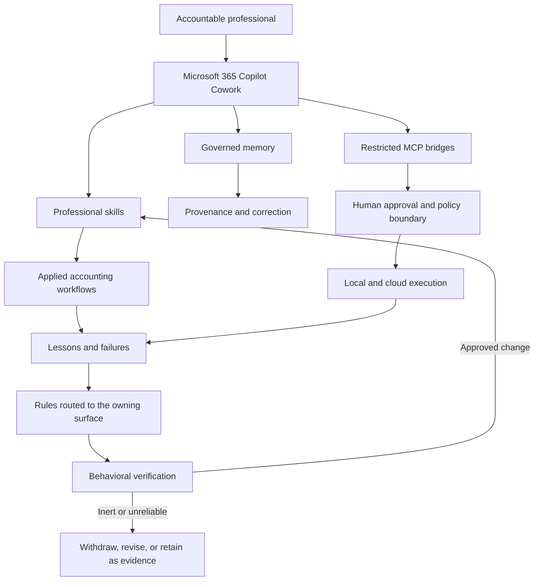

# Agent of Record

**A governed foundation for AI agents doing work a person signs their name to, built and operated in public accounting: durable memory, human-approved execution, behavioral learning, and auditable automation.**

| | |
|---|---|
| **Status** | v0.3 - portable. Windows and macOS, with a contributor on the macOS side. `main` keeps its history from this release; changes arrive by pull request and the gate runs on both platforms in CI. Interfaces may still change between minor versions. |
| **Platform** | Windows and macOS/Linux. The local layer is VS Code tasks over per-platform launchers - PowerShell and batch files on Windows, shell scripts under `Startup/posix/` elsewhere. The command bridge is one implementation with one refusal set, proven on whichever platform runs the gate. |
| **Host** | The four bridges are standard MCP servers. Microsoft 365 Copilot Cowork is the client this repository was built and operated against; it is reached through a dev tunnel only because that client is cloud-hosted. Any MCP client that can start a local process can use the two own-code servers directly. |
| **Runs without the host** | `python examples/synthetic-control-loop/run.py` - the control loop end to end, no tenant, no tunnel, no network. |
| **Install** | [Setup from zero](docs/setup.md) (Windows) or [Setup on macOS and Linux](docs/setup-macos.md) - a bare machine to four reachable bridges and an installed configuration, with `scripts/install_check.py` proving it by completing a real MCP handshake against each bridge. `scripts/personalize.py` replaces every placeholder in one pass; each bridge ships its connector package under `Startup/Plugins/`. |

Professional work is adopting AI faster than it is developing the controls, operating models, and institutional knowledge needed to use it reliably.

This repository is a working reference implementation of that missing foundation. It demonstrates how AI agents can preserve governed knowledge, act through defined approval boundaries, capture operational failures, convert lessons into durable controls, and test whether those controls actually change behavior.

The foundation comes first. Applied tax, accounting, workpaper, research, review, and communication skills will be added as independently tested components built on top of it.

> This is not a collection of prompts and it is not presented as an official Microsoft product. It is a practitioner-built laboratory for the controlled use of agentic AI in public accounting and other professional environments where a person remains accountable for the result.

## Set up on your machine

Pick the product you use, then your platform. Each page is complete on its own — you
should not need to read anything else to get running.

### Copilot Cowork — runs in Microsoft's cloud and reaches the bridges through a dev tunnel

- [Windows PC](docs/setup.md) · operated daily
- [Mac or Linux](docs/setup-macos.md) · not yet operated

### Claude Cowork — runs on your machine and starts the bridges itself; no tunnel

- [Windows PC](docs/install/claude-cowork-windows.md) · not yet operated
- [Mac](docs/install/claude-cowork-mac.md) · not yet operated

**Not yet operated** means nobody has run that page end to end. If you do, please open a
pull request with your `install_check.py` result — that is what flips the status.

Agents: the install contract is in [`AGENTS.md`](AGENTS.md); it applies to every cell.

## Why this exists

The profession does not primarily have a prompting problem. It has an operating-model problem:

- What may an agent remember, and how is an incorrect memory corrected?
- What may it execute, and where must a person approve the action?
- How does a failure become a durable control instead of an anecdote in a chat transcript?
- How do we know a new rule changed behavior rather than merely adding more prose?
- How are production systems, confidential information, and publication boundaries protected?
- What evidence exists when a reviewer asks what happened, who changed it, and why?

This repository makes those questions concrete.

## What this demonstrates

- **Governed memory** with provenance, correction, version history, and one authoritative home per fact.
- **Restricted execution** through a batch bridge that accepts a filename, not a free-form command.
- **Human approval at the action boundary**, rather than a general statement that a human remains “in the loop.”
- **Explicit production controls** based on configuration flags and allowlists, not guessed from names.
- **Operational learning** that records the failed approach, the working approach, and the evidence.
- **Routed controls** that deliver a lesson into the skill or tool that owns the failure.
- **Behavioral verification** using three carried tests and a control arm.
- **Declared blind spots** where an automated check cannot observe direct session behavior.
- **A disclosure scan in CI** that refuses real user paths on either platform, tunnel hostnames, tenant identifiers and credential shapes on every push and pull request, and clean-room tooling that can rebuild a public tree from a private working copy when needed.
- **Negative results preserved as evidence**, including rules that were measured ineffective or inert.

## Architecture



See [the detailed architecture](docs/architecture.md), [the public-accounting vision](docs/public-accounting-vision.md), and [the control map](docs/public-accounting-control-map.md).

## Measured at this release

These are measurements from the published tree, not aspirational claims:

| Measure | Result |
|---|---:|
| Recorded lesson entries | 123 |
| Entries with an authored rule | 93 |
| Rules in the always-on tier | 32 |
| Lesson keys routed into skills | 80 |
| Lesson keys routed into plugin tools | 5 |
| Routed skills | 9 |
| Self-test suites | 13 |
| Behaviorally verified effective rules | 1 |
| Behaviorally verified inert rules | 1 |
| Rules proven fully enforced across every behavior surface | 0 |

The last result matters. Every automated check is currently blind to at least direct session behavior. The repository reports that boundary rather than calling partial enforcement complete.

See [Measured Results and Honest Boundaries](docs/measured-results.md).

## The four bridges

Cowork runs in a cloud container. The bridges provide narrow, governed access to the machine and Power Platform:

| Port | Bridge | Purpose | Implementation |
|---|---|---|---|
| 8931 | Playwright | Browser automation in a signed-in profile | Upstream `@playwright/mcp`, stateful |
| 8932 | Filesystem | Read and write explicitly named local roots | Upstream filesystem MCP server, stateless |
| 8933 | Approved batch executor | Execute an existing `.bat` or `.cmd` under `CommandJobs` | Own code, stateless |
| 8934 | Power Automate | Flow definitions, runs, connections, solutions, DLP, and ownership | Own code, 29 tools, stateless |

The 8933 executor accepts no command string, arguments, interpreter, working directory, environment, timeout override, or elevation option. The agent proposes an exact batch file, a person approves it, the filesystem bridge writes it, and the executor runs that named file.

The 8934 bridge uses delegated authorization-code and PKCE authentication. Environments are denied until allowlisted, production is flagged explicitly, writes can be pinned off per environment, deletion requires the current flow name, and mutating attempts are audited.

## How experience becomes a tested control

```text
Failure or better method
        ↓
Lessons corpus: failed / worked / why / evidence / Pattern-Key
        ↓
Generated delivery
  ├── always-on instruction digest
  ├── owning SKILL.md
  ├── owning plugin tool description
  └── per-surface preflight gate
        ↓
Behavioral verification
  ├── three tests with the rule carried
  └── one control without it
        ↓
Effective / inert / unreliable / ineffective / invalid
```

Delivery is not treated as enforcement. A rule in a skill reaches only sessions that load that skill. A linter that reads batch files cannot observe a direct action taken in the chat. The system records those distinctions.

## Start here

1. Run the demonstration: `python examples/synthetic-control-loop/run.py`. It shows a missing input becoming a hard stop, then a delivered rule judged against a control - see the [synthetic control-loop scenario](examples/synthetic-control-loop/README.md).
2. To run the bridges yourself, pick your product and platform under [Set up on your machine](#set-up-on-your-machine); [CoworkConfig/README.md](CoworkConfig/README.md) explains how to start with an empty corpus rather than the author's.
3. Read [Public Accounting Vision](docs/public-accounting-vision.md).
4. Review [Public Accounting Control Map](docs/public-accounting-control-map.md).
5. Read [Architecture and Trust Boundaries](docs/architecture.md).
6. Run the repository validation described in [Quick Start](docs/quickstart.md).
7. Review [Limitations](docs/limitations.md) before adapting any bridge.

## Repository map

```text
.github/         contribution and CI configuration
CommandJobs/     approval-gated standing jobs
CoworkConfig/    skills, memory, instructions, lesson routing, verification
docs/            public-accounting vision, controls, architecture, evidence, roadmap
examples/        synthetic demonstrations with no client or firm data
GitHubSetup/     clean-room publication and disclosure gates
scripts/         public repository validation and the personalizer
Startup/         four local MCP bridges, their connector packages, and the watchdog
```

## Future applied skills

The foundation is designed to support work a person signs their name to without embedding a client or firm process into the framework itself. Planned layers include:

- Tax provision preparation and review.
- State apportionment and allocation.
- Journal-entry and footnote preparation.
- Workpaper intake, validation, tie-out, and review.
- Reconciliation and close support.
- Research with citation and provenance controls.
- Client and stakeholder communication.
- Workflow conversion from desktop automation into tested Python packages.

Each applied skill is expected to define its inputs, evidence, deterministic calculations, failure behavior, review points, audit record, and tests before it is treated as reusable.

## Published writing

The repository is the implementation behind a longer body of practitioner writing that began with tax-software process design and progressed into governed agents, memory, local infrastructure, and behavioral learning.

- [I Taught My AI Assistant to Remember Its Own Mistakes. It Forgot to Load.](https://www.linkedin.com/pulse/i-taught-my-ai-assistant-remember-its-own-mistakes-forgot-rash-cpa-opwbc)
- [There Is No Such Thing as a Self-Building AI Tool](https://www.linkedin.com/pulse/thing-self-building-ai-tool-jordan-rash-cpa-vgqrc)
- [Configuring a Private AI Workstation at Home](https://www.linkedin.com/pulse/configuring-private-ai-workstation-home-jordan-rash-cpa-aot2c/)
- [Stateless MCP Just Fixed My Biggest Headache with Cowork](https://www.linkedin.com/pulse/stateless-mcp-just-fixed-my-biggest-headache-cowork-jordan-rash-cpa-9tvic)
- [Copilot Agents in Tax: From Prototype to Control-Governed Tool](https://www.linkedin.com/pulse/copilot-agents-tax-from-prototype-control-governed-tool-rash-cpa-ajfic)
- *Escaping the Context Window Trap: Three-Tier Memory Architecture for Local AI*
- [Tax Provision Software Implementation](https://www.linkedin.com/pulse/tax-provision-software-implementation-jordan-m-rash-cpa?articleId=6496057090656788480)
- [ONESOURCE Tax Provision: Automated Federal Return-to-Provision Functionality](https://www.linkedin.com/pulse/onesource-tax-provision-automated-federal-utilizing-income-rash-cpa)

See [Published Writing and Editorial Assessment](docs/published-writing.md).

## Validation

```bash
python scripts/public_scan.py
python scripts/release_check.py --json release-results.json
```

The release check runs the lessons validator, digest currency check, skill and plugin delivery checks, enforcement-scope audit, per-surface gate audit, the cross-surface bridge facts check, the synthetic control-loop demonstration, and the negative-control self-test suites. `--json` writes the results in machine-readable form. GitHub Actions runs the same checks on `windows-latest` and `macos-latest` for every push and pull request, and publishes a results file per platform as a build artifact.

## Author perspective

This work is built from the perspective of a public-accounting tax director designing and operating AI-assisted professional workflows.

The objective is not to prove that an AI can complete a task once. The objective is to build the surrounding system required to make repeated use controlled, explainable, reviewable, and improvable.

The operating rule is:

> Use models for ambiguity. Use code for invariants. Use people for accountable judgment.

## Status and roadmap

This is **v0.3: Portable**. The foundation now runs on Windows and macOS from one tree, the command bridge's refusals are proven live on both in CI, `scripts/install_check.py` defines "installed" as a completed MCP handshake rather than a file that exists, and `AGENTS.md` carries the install contract for any agent pointed at the folder. From this release `main` keeps its history and takes pull requests; the macOS layer has a contributor. The portable layer was pulled forward ahead of the applied-work contract because a contributor on a second platform needed it first; the two verification items carried from v0.2 - behavioral verdicts for ten routed rules, and reduction of duplicated configuration statements - move with the contract.

- **v0.4: Applied-work contract** — a common input, evidence, review, error, and audit contract for applied skills, plus the two carried verification items.
- **v0.5: Applied public-accounting skills** — independently tested workflows using synthetic data.
- **v1.0: Reference operating model** — reproducible deployment, governance, maintenance, and professional-review guidance.

See [Roadmap](docs/roadmap.md) and the [open issues and milestones](https://github.com/jordanmrash/agent-of-record/issues).

## Boundaries

This repository is a reference implementation, not a hosted service or a professional standard. It does not replace legal, security, privacy, independence, risk-management, or professional-judgment requirements.

The published tree contains no client material, firm-specific content, credentials, tenant identifiers, production configurations, or live tunnel addresses. It is scanned in CI on every push, and the history before v0.3.0 was rebuilt as a clean one-commit snapshot on each publication.

## License

MIT. See [LICENSE](LICENSE), [NOTICE](NOTICE), and [SECURITY.md](SECURITY.md).
