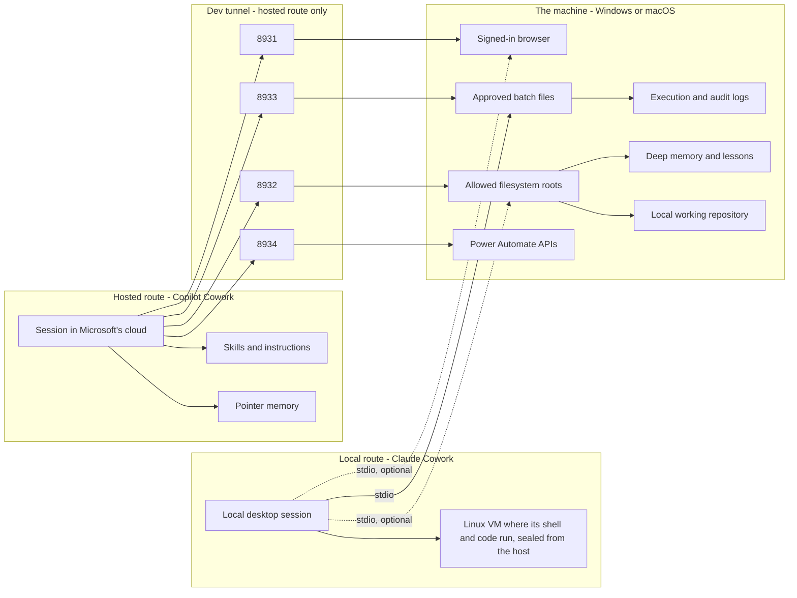
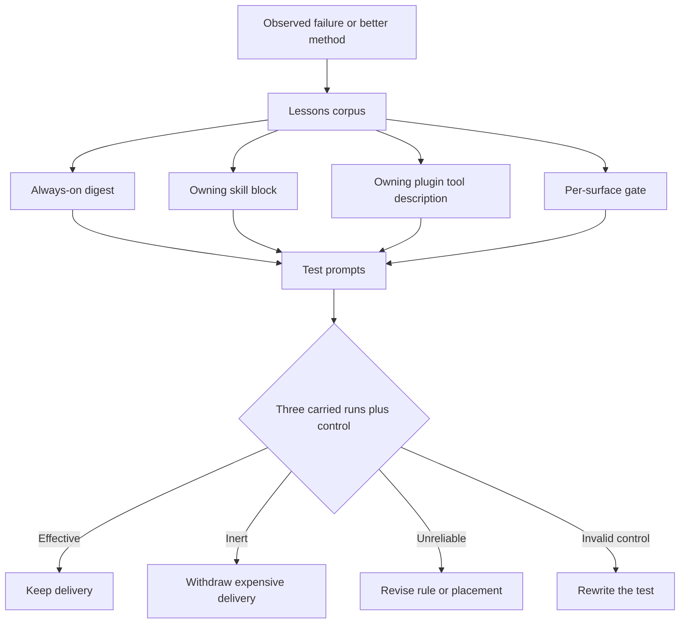

# Architecture and Trust Boundaries

## System view



Two routes reach the same machine. The hosted route needs everything in the
tunnel column, because the session runs in a cloud that cannot see the machine.
The local route needs none of it: the session starts the servers itself as stdio
processes, and its own shell runs inside a virtual machine that cannot reach the
host, which is why the approved batch executor is the one component that route
requires. [Choose your route](install/README.md) states the difference host by
host; the trust boundaries below are the same on both.

## Why four bridges remain separate

The browser bridge needs a persistent process to hold the signed-in profile. The filesystem, batch, and Power Automate bridges work better statelessly. Separate ports preserve per-bridge restart policy and prevent a failure in one capability from taking down every capability.

## Trust boundary: 8931 browser

- Runs against a signed-in browser profile.
- Can reach authenticated pages that a hosted web tool cannot.
- The signed-in profile is both the capability and the risk.
- Structured actions are preferred to arbitrary evaluation.

## Trust boundary: 8932 filesystem

- Reads and writes only explicitly named roots.
- Canonical-path handling belongs to the upstream server.
- Adding a root is a governance decision because it widens every file tool.
- Write access to `CommandJobs` is equivalent to potential execution authority.

## Trust boundary: 8933 batch executor

The executor accepts only:

```json
{"file": "relative-name.bat"}
```

It does not accept a command, arguments, interpreter, working directory, environment variables, output directory, timeout override, or elevation request.

Controls include:

- Canonical containment under `CommandJobs`.
- `.bat` and `.cmd` on Windows, `.sh` on POSIX; no other file type.
- Fixed timeout and output caps.
- One concurrent job.
- Closed standard input and hidden process window.
- Per-run logs and file-change inventory.
- Output folder declared inside the reviewed batch file.

Residual risk: a reviewed batch file can contain any command the signed-in user can run.

## Trust boundary: 8934 Power Automate

The bridge spans three Microsoft APIs:

- Dataverse for flow definitions and state.
- Flow service for runs, history, actions, and triggers.
- PowerApps API for connections and related metadata.

Controls include:

- Delegated authorization-code and PKCE authentication.
- No client secret.
- Environment allowlist.
- Explicit production classification.
- Global and per-environment read-only controls.
- Separate delete opt-in.
- Current-name confirmation for deletion.
- Audit record for mutating attempts and refusals.

## Learning architecture



## Publication architecture

The working repository is never pushed. It has held non-public material in prior commits, and deleting a path does not remove it from history.

The public repository is therefore:

1. Built into a new directory.
2. Populated from explicit include lists.
3. Sanitized in file contents and names.
4. Scanned for identifiers, credentials, and name-shaped prose.
5. Regenerated so generated control blocks match the sanitized corpus.
6. Initialized as a new repository with one commit (the model through v0.3.0).

Through v0.3.0 this was intentionally a curated snapshot, not a conventional mirror of the working history. From v0.3.0 `main` keeps its history: changes arrive as pull requests, pass the gate on Windows and macOS in CI, and merge after review. The disclosure scan that once ran before each rebuild now runs on every push.

The publishing tooling in `GitHubSetup/` remains the way a fresh tree is produced from a private working copy when that is ever needed again; it is no longer the way `main` is updated.
